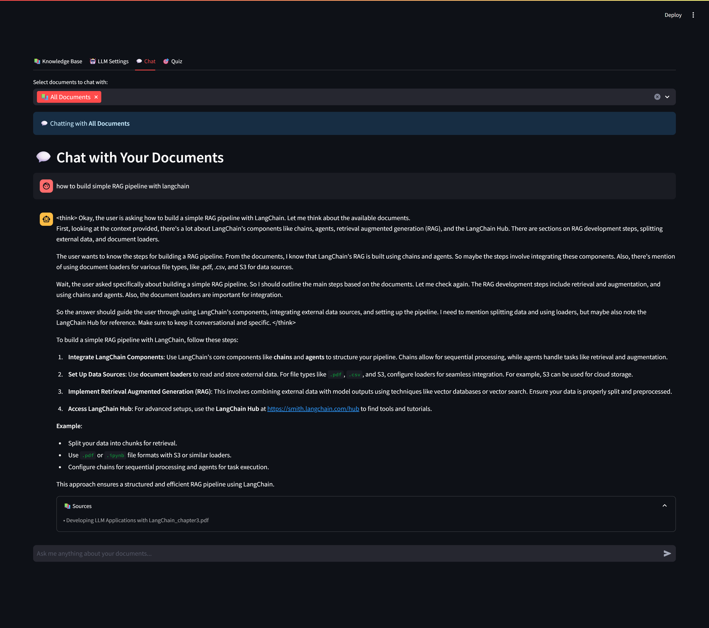
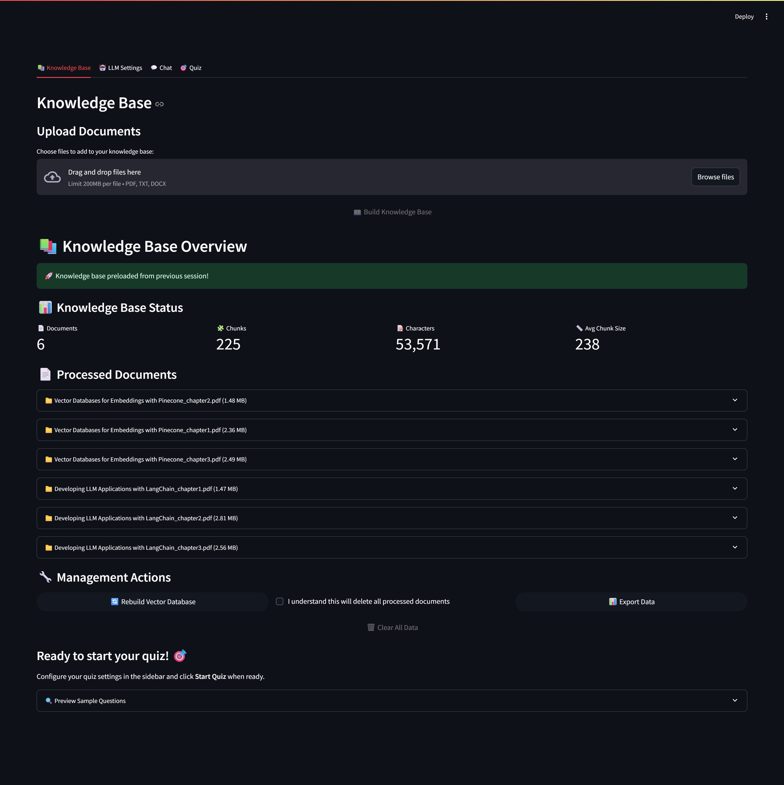
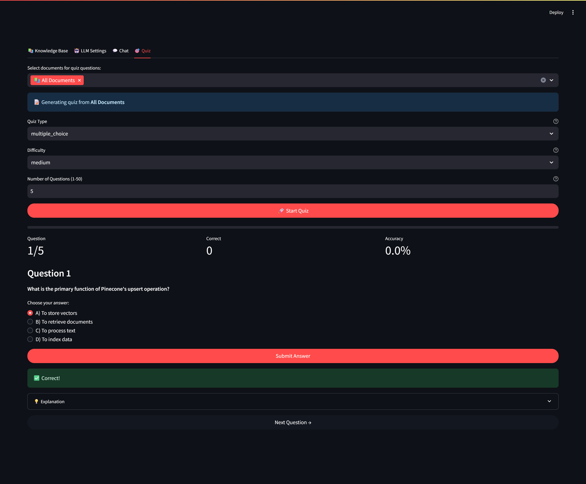
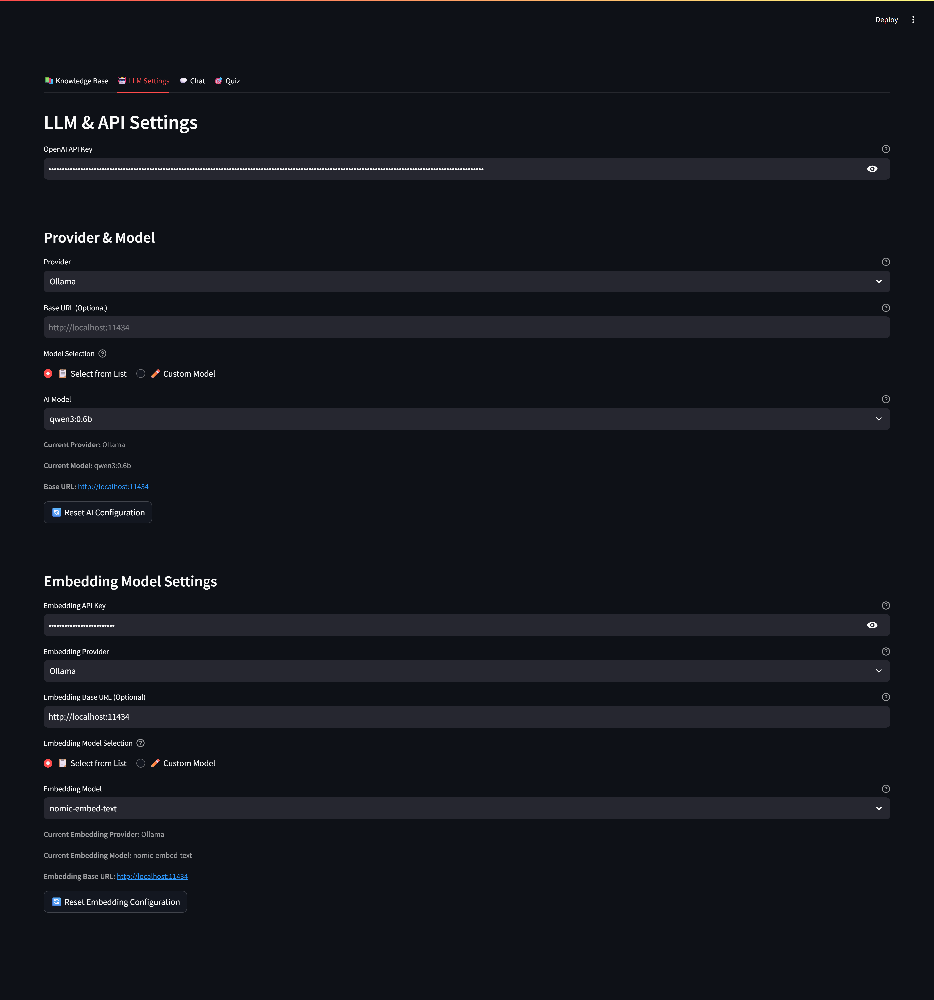

# 🧠 Knowledge Quiz Bot

> Your AI-powered learning companion, inspired by Google's NotebookLM

A sophisticated AI platform that transforms your documents into interactive learning experiences. Upload PDFs, text files, or Word documents, then either chat with your content or take personalized quizzes to test and reinforce your knowledge.

## 🌟 Features

### 📚 **Smart Document Processing**
- **Multiple formats**: PDF, TXT, DOCX support
- **Intelligent chunking**: Optimized text segmentation
- **Vector embeddings**: Semantic search capabilities
- **Source citations**: Track information back to original documents

### 💬 **Interactive Chat Interface**
- **Document selection**: Chat with specific files or all documents
- **Contextual responses**: AI answers based only on your uploaded content
- **Source citations**: See exactly which documents inform each response
- **Conversation starters**: Get helpful suggestions to begin your chat

### 🎯 **Adaptive Quiz Generation**
- **Multiple question types**: Multiple choice, True/False, Short answer
- **Difficulty adaptation**: AI adjusts based on your performance
- **Context-aware**: Questions generated from your specific content
- **Detailed explanations**: Learn from both correct and incorrect answers

### 📊 **Progress Tracking**
- **Real-time scoring**: Track accuracy and improvement
- **Performance analytics**: Understand your learning patterns
- **Grade calculation**: Get meaningful feedback on your progress
- **History tracking**: Review past quiz sessions

### 🎨 **Modern Interface**
- **Clean design**: Inspired by NotebookLM's user experience
- **Responsive layout**: Works on desktop and mobile
- **Interactive elements**: Smooth animations and feedback
- **Intuitive navigation**: Easy-to-use sidebar controls

## 🚀 Quick Start

### Prerequisites
- Python 3.8+
- OpenAI API key ([Get one here](https://platform.openai.com/api-keys))

### Installation

1. **Clone the repository**
   ```bash
   git clone https://github.com/dangtrannam/knowledge-quiz-bot.git
   cd knowledge-quiz-bot
   ```
2. **Install dependencies**
   ```bash
   pip install -r requirements.txt
   ```
3. **Run the application**
   ```bash
   python run start.py
   ```
4. **Open your browser**
   Navigate to `http://localhost:8501`

## 📖 How to Use

1. **Configure API Settings**: Enter your OpenAI API key in the sidebar. Optionally configure custom base URL and select AI model.
2. **Upload Documents**: Click "Choose files" to upload your learning materials (PDF, TXT, DOCX supported).
3. **Build Knowledge Base**: Click "📖 Build Knowledge Base" to process your documents.
4. **Choose Your Mode**: Select Chat or Quiz mode from the navigation tabs.
5. **Chat Mode**: Select documents, ask questions, and get contextual answers with source citations.
6. **Quiz Mode**: Configure quiz settings, start the quiz, answer questions, and review results.

## 🏗️ Architecture

The project follows a modular architecture inspired by modern RAG and LangChain best practices:

```
knowledge-quiz-chatbot/
├── app.py                  # Main Streamlit application
├── knowledge_manager.py    # Orchestrates document ingestion, embedding, vector storage, and retrieval
├── loaders/                # Document loading and splitting
│   └── document_loader.py
├── embeddings/             # Embedding model abstraction
│   └── embedding_model.py
├── vector_stores/          # Vector store management (ChromaDB)
│   └── chroma_store.py
├── retrievers/             # Retrieval logic
│   └── vector_retriever.py
├── agents/                 # Quiz and chat agent logic
│   ├── quiz_agent.py
│   └── chat_agent.py
├── llm/                    # LLM, embedding, TTS, STT providers and abstraction
│   ├── base.py
│   ├── litellm_provider.py
│   └── ...
├── services/               # Service orchestration (agent manager, document processor, vector store service)
│   ├── agent_manager.py
│   ├── document_processor.py
│   └── vector_store_service.py
├── ui/                     # UI components and flows
│   ├── utils.py
│   ├── knowledge_base.py
│   ├── chat.py
│   ├── quiz.py
│   ├── screens.py
│   └── session.py
├── prompts/                # Prompt templates for LLMs
│   ├── chat_prompt.py
│   └── quiz_prompt.py
├── tests/                  # Unit and integration tests
│   ├── unit_tests/
│   └── integration/
├── constants.py            # Provider/model configuration
├── requirements.txt        # Python dependencies
├── README.md               # This file
└── docs/                   # Project documentation
```

### Key Documentation
- [API Reference](docs/api_reference.md)
- [Developer Guide](docs/developer_guide.md)
- [Testing Checklist](docs/test_checklist.md)
- [Refactor Plan](docs/refactor_plan.md)

## 🛠️ Technical Details

- **LLM Abstraction**: Easily switch between OpenAI, Gemini, Anthropic, Ollama, and more via `llm/`.
- **Prompt Engineering**: All prompt templates are centralized in `prompts/`.
- **Service Layer**: Agent and vector store orchestration in `services/`.
- **UI**: Modular Streamlit UI in `ui/`.
- **Testing**: Comprehensive unit and integration tests in `tests/`.

## Screenshots

### Chat Interface


### Document Management


### Quiz Mode


### Settings Page


## 🗺️ Roadmap

- [ ] Multi-language support
- [ ] Advanced analytics
- [ ] Collaborative features
- [ ] Custom prompts
- [ ] Export functionality
- [ ] Integration APIs
- [ ] Voice interactions
- [ ] Mobile app

## 🙏 Acknowledgments
- **Google NotebookLM**: Inspiration for the user experience and document processing approach
- **LangChain**: Powerful framework for building LLM applications
- **Streamlit**: Excellent platform for creating ML web applications
- **OpenAI**: Advanced language models that power the question generation

## 📞 Support
- **Issues**: [GitHub Issues](https://github.com/dangtrannam/knowledge-quiz-bot/issues)
- **Discussions**: [GitHub Discussions](https://github.com/dangtrannam/knowledge-quiz-bot/discussions)
- **Email**: dangtrannam2001@gmail.com 