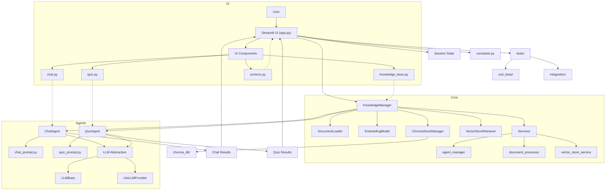

# API Reference: Knowledge Quiz Chatbot

---

## Architecture Overview

---

## Modules & Key Classes

### app.py
- **Streamlit UI**: Orchestrates user interaction, file upload, mode selection, and displays results.
- **Session State**: Manages user session, API keys, and mode switching.

### knowledge_manager.py
- **KnowledgeManager**: Orchestrates document ingestion, chunking, embedding, vector store management, and metadata.
  - `process_documents(uploaded_files)`
  - `process_text_content(text_content, source_name)`
  - `search_knowledge_base(query, k)`
  - `get_stats()`
  - `clear_knowledge_base()`
  - `rebuild_vectorstore()`
  - `is_file_already_processed(uploaded_file)`

### loaders/document_loader.py
- **DocumentLoader**: Loads and splits PDF, TXT, DOCX files into chunks.
  - `load_document(file_path, original_filename)`
  - `split_documents(documents)`

### embeddings/embedding_model.py
- **EmbeddingModel**: Handles initialization and access to the embedding model for document embeddings.
  - `get()`
  - `is_ready()`
  - `reset()`
- **LiteLLMEmbeddings**: LangChain-compatible embedding wrapper using LiteLLMProvider.
  - `embed_query(text)`
  - `embed_documents(texts)`

### vector_stores/chroma_store.py
- **ChromaStoreManager**: Handles creation, loading, persistence, clearing, and rebuilding of the Chroma vector store.
  - `create_from_documents(documents, embeddings)`
  - `load_existing(embeddings)`
  - `add_documents(documents)`
  - `persist()`
  - `clear_all_data()`
  - `rebuild(documents, embeddings)`

### retrievers/vector_retriever.py
- **VectorStoreRetriever**: Handles retrieval operations from a vector store, including similarity search and topic-based context retrieval.
  - `similarity_search(query, k, selected_documents)`
  - `get_random_context(min_length, selected_documents)`
  - `get_context_by_topic(topic, k)`
  - `get_all_chunks(selected_documents)`

### agents/quiz_agent.py
- **QuizAgent**: Generates quiz questions, adapts difficulty, handles LLM errors.
  - `generate_questions_batch_from_context(context, num_questions, question_type, difficulty)`
  - `check_answer(user_answer, question_data)`
  - `get_aggregated_context(selected_documents)`

### agents/chat_agent.py
- **ChatAgent**: Handles chat Q&A, context retrieval, prompt construction, and LLM calls.
  - `generate_response(user_message, selected_documents, chat_history)`
  - `get_conversation_starters(selected_documents)`

### prompts/
- **chat_prompt.py, quiz_prompt.py**: Prompt templates for LLMs, using LangChain's `ChatPromptTemplate`.

### llm/
- **LLMBase**: Abstract base class for LLM providers (chat, completion, embedding, TTS, STT).
- **LiteLLMProvider**: LLM provider using LiteLLM for unified access to OpenAI, Gemini, Anthropic, Ollama, etc.
  - `chat(messages, **kwargs)`
  - `completion(prompt, **kwargs)`
  - `embed(texts, **kwargs)`
  - `tts(text, voice, **kwargs)` (not implemented)
  - `stt(audio, **kwargs)` (not implemented)

### services/
- **agent_manager.py**: Initializes and manages LLM providers and agents (QuizAgent, ChatAgent).
  - `initialize_llm_provider(session_state)`
  - `initialize_agents(session_state, km)`
- **document_processor.py**: Handles file upload, document loading, and chunking.
  - `process_uploaded_file(uploaded_file)`
  - `process_text_content(text_content, source_name)`
- **vector_store_service.py**: Manages vector store creation, loading, and persistence.
  - `create_from_documents(texts, embeddings)`
  - `add_documents(texts)`