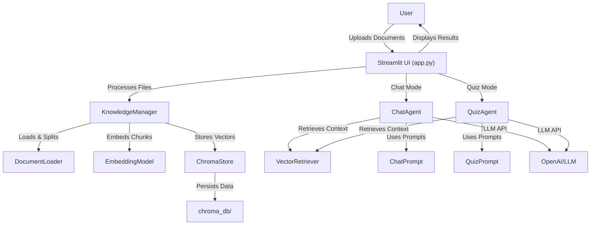

# API Reference: Knowledge Quiz Chatbot

---

## Architecture Overview

---

## Modules & Key Classes

### app.py
- **Streamlit UI**: Orchestrates user interaction, file upload, mode selection, and displays results.
- **Session State**: Manages user session, API keys, and mode switching.

### knowledge_manager.py
- **KnowledgeManager**: Handles document ingestion, chunking, embedding, vector store management, and metadata.
  - `add_documents(files)`
  - `clear_knowledge_base()`
  - `get_documents()`
  - `rebuild_vector_store()`

### loaders/document_loader.py
- **DocumentLoader**: Loads and splits PDF, TXT, DOCX files into chunks.
  - `load(file)`
  - `split(text)`

### embeddings/embedding_model.py
- **EmbeddingModel**: Loads HuggingFace model, generates embeddings, handles device selection and errors.
  - `embed(text)`
  - `validate()`

### vectorstores/chroma_store.py
- **ChromaStore**: Manages ChromaDB vector store, adds and retrieves vectors, persists data.
  - `add_documents(chunks, embeddings)`
  - `clear()`
  - `get_vectors()`

### retrievers/vector_retriever.py
- **VectorRetriever**: Performs similarity search and context retrieval from vector store.
  - `retrieve(query)`
  - `random_context()`

### agents/quiz_agent.py
- **QuizAgent**: Generates quiz questions, adapts difficulty, handles LLM errors.
  - `generate_questions(context)`
  - `validate_answer(answer)`

### agents/chat_agent.py
- **ChatAgent**: Handles chat Q&A, context retrieval, prompt construction, and LLM calls.
  - `chat(query, context)`

### prompts/
- **chat_prompt.py, quiz_prompt.py**: Prompt templates for LLMs.

### ui/utils.py
- **UI Utilities**: Page config, custom CSS, and helper functions.

### tests/
- **Unit & Integration Tests**: See `docs/test_checklist.md` for coverage.

---

## See Also
- [Developer Guide](developer_guide.md)
- [Testing Checklist](test_checklist.md)
- [Refactor Plan](refactor_plan.md) 