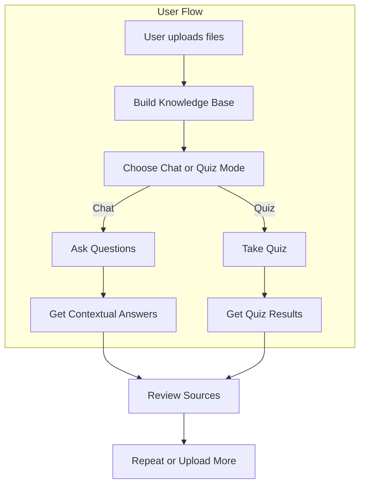

# Developer Guide: Knowledge Quiz Chatbot

---

## User Flow Overview



---

## Project Setup

1. **Clone the repository**
   ```bash
   git clone https://github.com/dangtrannam/knowledge-quiz-bot.git
   cd knowledge-quiz-bot
   ```
2. **Install dependencies**
   ```bash
   pip install -r requirements.txt
   ```
3. **Run the app**
   ```bash
   streamlit run app.py
   ```

## Contribution Guidelines

- Follow modular structure: add new logic in the appropriate folder (agents, loaders, embeddings, services, ui, etc.)
- Write unit and integration tests for all new features (see `tests/`)
- Use clear, descriptive commit messages
- Update documentation and diagrams as needed
- Run all tests before submitting PRs

## Extension Points

### Adding a New Retriever
- Create a new file in `retrievers/` and implement your retrieval logic as a class (e.g., `MyRetriever`).
- Register your retriever in `KnowledgeManager` or wherever retrieval is orchestrated.
- Write unit tests for your retriever in `tests/unit_tests/`.

### Adding a New Agent
- Add your agent class to `agents/` (e.g., `my_agent.py`).
- Update `services/agent_manager.py` to initialize and manage your new agent.
- Update UI logic in `app.py` and/or `ui/` to expose the new agent's functionality.
- Add prompt templates to `prompts/` if needed.

### Adding a New LLM Provider
- Implement a new provider class in `llm/` (subclass `LLMBase`).
- Add provider selection logic to `services/agent_manager.py` and UI (see LLM Settings tab in `ui/screens.py`).
- Update `constants.py` to add provider/model options and defaults.
- Ensure your provider supports the required interface (`chat`, `completion`, `embed`, etc.).
- Add tests for your provider.

### Adding a New UI Screen or Flow
- Add a new file to `ui/` (e.g., `my_feature.py`).
- Register your screen or component in `ui/screens.py` and/or `app.py`.
- Use Streamlit best practices for layout, state, and interactivity.
- Add tests for your UI logic if possible.

### Adding New File Types
- Extend `DocumentLoader` in `loaders/document_loader.py` to support new file extensions.
- Add logic for parsing and chunking the new file type.
- Update tests to cover the new loader logic.

### Adding New Prompt Templates
- Place new prompt templates in `prompts/`.
- Reference them in your agent or chain logic.
- Use LangChain's `ChatPromptTemplate` for consistency.

## Coding Standards

- Use type hints and docstrings for all public functions and classes.
- Handle errors gracefully and log issues with context.
- Prefer composition over inheritance for new modules.
- Keep functions/classes small and focused.
- Use meaningful, descriptive names for variables, functions, and classes.
- Comment complex or non-obvious logic.
- Handle edge cases and validate inputs/outputs.
- Use modular folder structure: `loaders/`, `embeddings/`, `vector_stores/`, `retrievers/`, `chains/`, `agents/`, `llm/`, `ui/`, `prompts/`, `services/`, `tests/`.
- Use `.env` and `python-dotenv` for configuration and secrets.
- Validate configuration and inputs with `pydantic` where appropriate.
- Write tests for all new features and bug fixes.
- Follow PEP8 and use tools like `black` and `flake8` for formatting and linting.

## Testing

- Run all tests:
  ```bash
  pytest tests/
  ```
- See [Testing Checklist](test_checklist.md) for coverage and patterns
- Use `tests/integration/` for end-to-end and app flow tests
- Each component should have its own test file (see `test_*.py`)

## Extending the App

- **Add a new retriever**: Create a new file in `retrievers/`, implement retrieval logic, and register in `KnowledgeManager`.
- **Add a new agent**: Add to `agents/`, update UI and session state logic in `app.py` and `ui/`.
- **Add new prompt templates**: Place in `prompts/` and reference in agent logic.
- **Add new file types**: Extend `DocumentLoader` in `loaders/`.
- **Improve UI**: Update `ui/utils.py` and Streamlit code in `app.py` or `ui/screens.py`.
- **Add a new LLM provider**: Implement in `llm/`, update provider selection logic, and add to `constants.py`.

## Coding Best Practices

- Modularize code for maintainability and scalability.
- Use dependency injection for LLM providers and retrievers.
- Centralize configuration and secrets.
- Log all errors and important events.
- Write clear, actionable documentation and keep it up to date.
- Review code for performance and security.

## Resources
- [API Reference](api_reference.md)
- [Testing Checklist](test_checklist.md)
- [Refactor Plan](refactor_plan.md) 