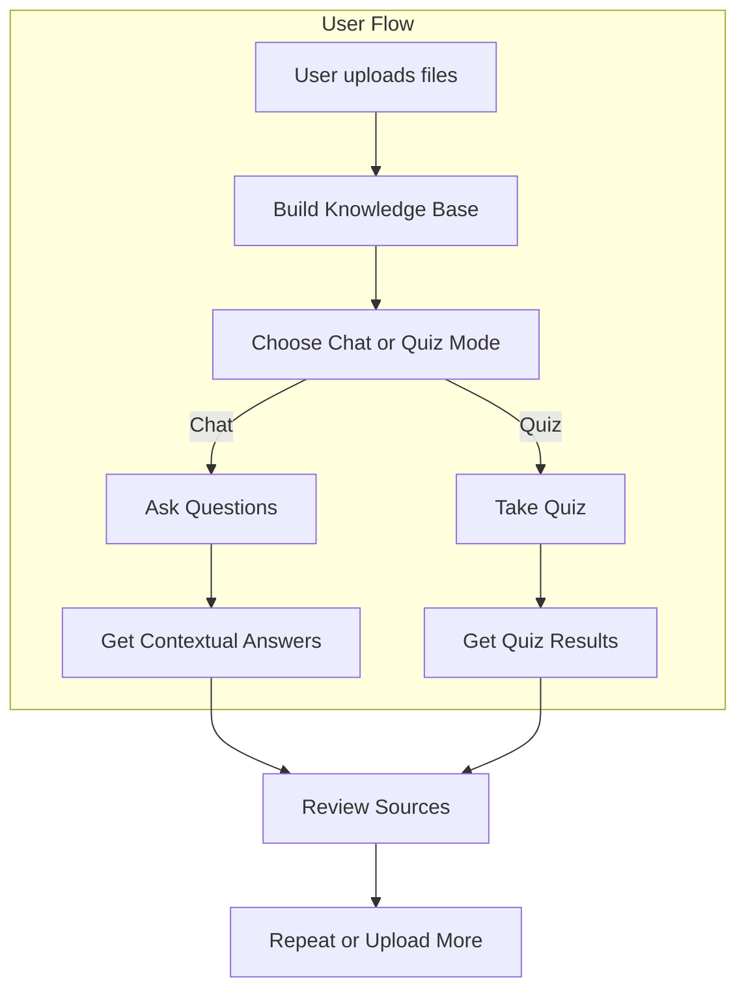

# Developer Guide: Knowledge Quiz Chatbot

---

## User Flow Overview



---

## Project Setup

1. **Clone the repository**
   ```bash
   git clone https://github.com/your-username/knowledge-quiz-bot.git
   cd knowledge-quiz-bot
   ```
2. **Install dependencies**
   ```bash
   pip install -r requirements.txt
   ```
3. **Run the app**
   ```bash
   streamlit run app.py
   ```

## Contribution Guidelines

- Follow modular structure: add new logic in the appropriate folder (agents, loaders, embeddings, etc.)
- Write unit and integration tests for all new features (see `tests/`)
- Use clear, descriptive commit messages
- Update documentation and diagrams as needed
- Run all tests before submitting PRs

## Testing

- Run all tests:
  ```bash
  pytest tests/
  ```
- See [Testing Checklist](test_checklist.md) for coverage and patterns
- Use `tests/integration/` for end-to-end and app flow tests
- Each component should have its own test file (see `test_*.py`)

## Extending the App

- **Add a new retriever**: Create a new file in `retrievers/`, implement retrieval logic, and register in `KnowledgeManager`
- **Add a new agent**: Add to `agents/`, update UI and session state logic in `app.py`
- **Add new prompt templates**: Place in `prompts/` and reference in agent logic
- **Add new file types**: Extend `DocumentLoader` in `loaders/`
- **Improve UI**: Update `ui/utils.py` and Streamlit code in `app.py`

## Coding Standards

- Use type hints and docstrings
- Handle errors gracefully and log issues
- Prefer composition over inheritance for new modules
- Keep functions/classes small and focused

## Resources
- [API Reference](api_reference.md)
- [Refactor Plan](refactor_plan.md)
- [Testing Checklist](test_checklist.md) 